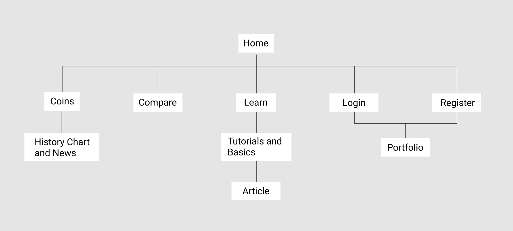
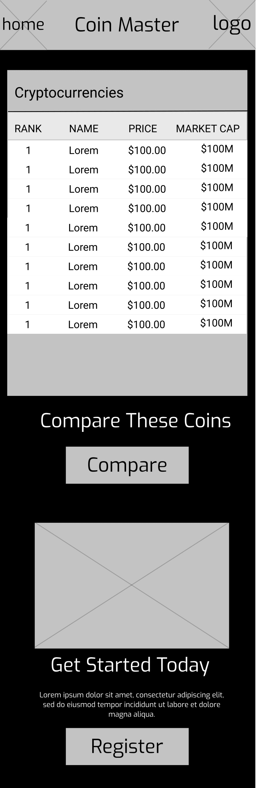

# User Experience Design

## Prototype
### Prototype Description: 
- Prototype Figma (recomended link): https://www.figma.com/proto/bJSjjfSp3fyLIHlSVmSWzf/CoinMaster?node-id=101%3A322&scaling=min-zoom&page-id=33%3A131&starting-point-node-id=101%3A322
- Prototype Invision (same content): https://yogakeshnenkeshnenyogaindran430063.invisionapp.com/freehand/CoinMaster-pgu38GUwX?dsid_h=92d20c84e4b11df2a52c9f58c15a4a5604a718582e325b10630ee4f81ee1b21f&uid_h=ee05d0500798ca5f80d6f7670bc0dcbbeb44bf407892881064c161107b1f4859

## App Map

## Wireframes
### Home Page:

The default screen from which users can navigate to all sub screens.

### Coins Page:

The screen that displays ranked cryptocurrencies with live prices.

### Compare Page:

The screen provides function to compare multiple cryptocurrencies and generate comparison charts.

### Comparison Page:

The dropdown menu of the Compare Page from which users can choose the cryptocurrencies to compare.

### Tutorials Page:

The screen with tutorials for beginners on how-to's on cryptocurrencies trading.

### Article Page:

The screen for each of the articles on the Tutorials Page.

### Login Page:

The screen for user account's login.

### Register Page:

The screen for user account's registration.

### Portfolio Page:

The screen for virtual investment on cryptocurrencies. Users are required to log in before accessing it.
